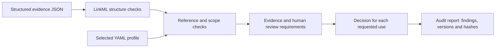

# BioAI Evidence Validator

**Is a biological assertion supported well enough for its intended use?**
This Python toolkit checks evidence structure, provenance consistency, scope,
and review requirements, then reports a decision for each requested use.
It can sit between AI-assisted extraction and a curated knowledge base or dataset.

`main` is the domain-neutral framework (0.4.1). Domain rules are YAML profiles;
new entity types, relations, evidence types, and uses do not require engine edits.
The complete canine implementation and SQLite adapter live on the
[`canine-breed` branch](https://github.com/NingyuSUN/bioai-evidence-validator/tree/canine-breed).

## How it works



| Example profile | Assertion | Use contract |
|---|---|---|
| `general` | Any typed entity–relation–entity statement | Provenance, scoped support, optional human review by use |
| `literature-claim` | Gene/variant associated with phenotype/disease | Publication evidence; human acceptance for knowledge-base admission |
| `dataset-label` | Sample assigned a label | Curated label plus sample link; human acceptance for training |
| Custom YAML | Compound measured response in an assay | Assay evidence; defined without changing Python code |

## Try it

Python 3.11+ and uv, from the repository root:

```bash
uv sync --frozen --extra dev
uv run bioevidence profiles
uv run bioevidence validate examples/general/curated_assertion.json
uv run bioevidence validate examples/literature_claim/llm_only.json --profile literature-claim
uv run bioevidence validate examples/custom_profile/assay_record.json --profile examples/custom_profile/assay.yaml
uv run pytest
```

The LLM-only example intentionally requires review (exit **2**).
Other validation codes: **0** admitted, **1** rejected, **3** input/configuration error.
Use `--output report.json` to save findings, per-use decisions, and input/schema/profile hashes.

## Real-data case

[VBO canine name mapping](examples/vbo_canine/README.md) uses a frozen public ontology:
72 real-name cases, 160 controlled errors, and 16 separately reported trust-boundary
cases. It compares schema-only checks, the previous aggregate quality gate, and
per-required-evidence-type validation. Source-derived labels are not expert annotations.

```bash
uv run python examples/vbo_canine/run.py --output artifacts/vbo-canine
```

## Scope

The VBO case uses attributed public data; other fixtures are synthetic.
Admission means **the supplied record meets the selected
profile**, not that a biological claim is true. The toolkit does not retrieve papers,
verify reviewer identities, train models, or measure prediction accuracy. The generic core compares supplied hashes; the VBO importer also hashes its local source
projection. External source truth and cohort independence require upstream verification.

[Create a profile](docs/PROFILES.md) · [Engineering contract](docs/ENGINEERING.md) ·
[Design case study](docs/CASE_STUDY.md) · [0.3 migration](docs/MIGRATION-0.4.md) ·
[Architecture decision](docs/ADR-002-domain-neutral-main.md) · [Apache-2.0](LICENSE)
