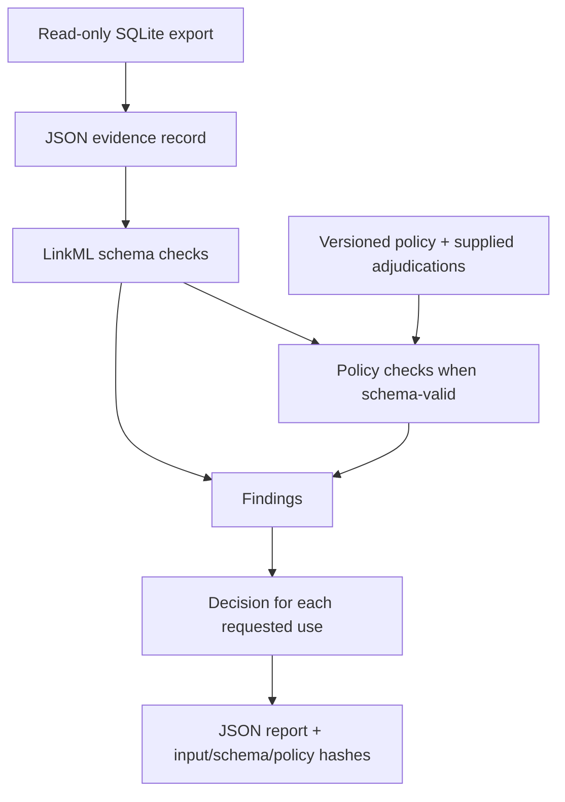

# BioAI Evidence Validator

**Schema-valid biological records can still lack evidence for their intended use.**
This Python toolkit separates structural validation, evidence-policy checks,
and use-specific admission for AI-assisted curation.

Version 0.3 supports canine breed evidence and a read-only SQLite adapter.
It checks supplied records, not biological truth or breed-classification accuracy.

## Validation workflow



| Layer | Checks |
|---|---|
| Schema | Required fields, types, and relationships |
| Policy | Source identity, mapping scope, and review requirements |
| Admission | Admitted, rejected, or review required for each use |

A name suitable for catalog display may still lack verified sample membership
or human acceptance for training.

## Run the synthetic examples

Python 3.11+ and uv, from the repository root:

```bash
uv sync --frozen --extra dev
uv run bioevidence validate examples/canine_breed/valid_labrador.json --output validation_report.json
uv run bioevidence validate examples/canine_breed/ambiguous_boxer.json
uv run pytest
```

Labrador is admitted for catalog/display use. Boxer is rejected for its requested
sample/training uses and intentionally exits with code 1.

`validate` exit codes: **0** admitted · **1** rejected · **2** review required.
Operational errors exit **3**. Invalid or unknown requested uses are rejected.
Reports include findings, use decisions, input/schema/policy hashes, and versions.
Missing policy rules, incompatible claims and unsupported evidence cannot silently
produce admission; [policy 0.3](docs/ENGINEERING.md#policy-03) documents the contracts.

## SQLite integration

The [adapter](docs/CANINE_PANEL_ADAPTER.md) requires a standalone SQLite snapshot,
checks its hash before and after read-only export, rejects duplicate IDs, logs
unresolved rows, and requires a fresh output directory.
Export completion does not imply record admission; inspect the reports.

Keep company records, source snapshots, sample identifiers, and private reviews
in the private project. Public examples are synthetic.

[Design rationale](docs/ADR-001-canine-breed-first.md) ·
[Versioned policy](src/bioevidence_validator/policies/canine_breed_catalog_v0.3.yaml) ·
[Case study](docs/CASE_STUDY.md) · [Tests](tests/) · [Engineering contract](docs/ENGINEERING.md) · [Apache-2.0](LICENSE)
