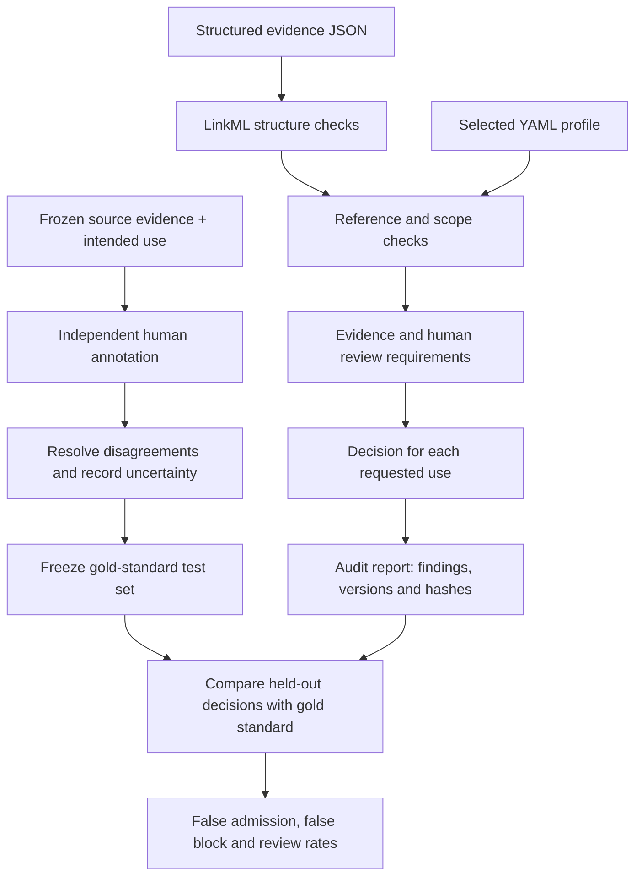

# BioAI Evidence Validator

[](https://github.com/NingyuSUN/bioai-evidence-validator/actions/workflows/ci.yml)
[](https://pypi.org/project/bioai-evidence-validator/)
[](https://github.com/NingyuSUN/bioai-evidence-validator/blob/main/pyproject.toml)
[](https://github.com/NingyuSUN/bioai-evidence-validator/blob/main/LICENSE)
[](https://colab.research.google.com/github/NingyuSUN/bioai-evidence-validator/blob/main/examples/quickstart.ipynb)
[](https://ningyusun.github.io/bioai-evidence-validator/)

**Stop AI-extracted biological claims from entering your knowledge base or
training set before their evidence is good enough for that use.**

An LLM can turn a paper into a tidy `gene → associated_with → phenotype` record
that passes every schema check. This toolkit asks the next question: *is the
evidence behind it sufficient for the specific use you have in mind?* It checks
evidence structure, provenance consistency, scope and human-review requirements,
then returns an auditable **admitted / review_required / rejected** decision for
each requested use.

```bash
pip install bioai-evidence-validator
```

Or try it in the browser, nothing to install:
[quickstart notebook on Colab](https://colab.research.google.com/github/NingyuSUN/bioai-evidence-validator/blob/main/examples/quickstart.ipynb).
Full documentation: **[ningyusun.github.io/bioai-evidence-validator](https://ningyusun.github.io/bioai-evidence-validator/)**.

## 30-second example

The two records below are identical except for one field: how the supporting
evidence was extracted.

```diff
   "evidence_type": "publication_result",
-  "extraction_method": "llm_extraction",
+  "extraction_method": "manual_curation",
```

```console
$ bioevidence validate examples/literature_claim/llm_only.json --profile literature-claim
```

```json
{
  "overall_status": "review_required",
  "findings": [
    {
      "rule_id": "BEV008",
      "severity": "review",
      "message": "Required evidence type 'publication_result' comes only from LLM extraction.",
      "blocking_uses": ["research_summary"]
    }
  ],
  "use_decisions": [
    { "use": "research_summary", "admission_status": "review_required", "reason_codes": ["BEV008"] }
  ]
}
```

The command exits with **2**, so a pipeline can route the record to a reviewer.
The manually curated version (`examples/literature_claim/curated_association.json`)
is `admitted` with exit code **0**. Every full report also records the input,
schema and profile SHA-256 hashes and versions for audit.

## Why not just JSON Schema or Pydantic?

A schema tells you a record is well formed. It cannot tell you whether the
record is trustworthy enough for a particular purpose.

| | Schema validation | This validator |
|---|:---:|:---:|
| Record shape and types | ✅ | ✅ (LinkML) |
| Different evidence rules per intended use (summary vs. KB vs. training) | — | ✅ |
| Quality gate per required evidence type (LLM-only evidence cannot ride on unrelated manual evidence) | — | ✅ |
| Provenance consistency (source hashes, resolved references, scope) | — | ✅ |
| Human adjudications bound to a specific statement and use | — | ✅ |
| Machine-readable audit report with hashes of input, schema and profile | — | ✅ |
| Mapped to ECO, Biolink and GA4GH VA-Spec ([standards alignment](https://github.com/NingyuSUN/bioai-evidence-validator/blob/main/docs/STANDARDS.md)) | — | ✅ |

On both real-data benchmarks below, schema-only checks admitted **160/160**
injected faults; the full validator admitted **0/160**. On ClinVar, 1★ and 2★ variants
the validator holds back were **about 4–5× more likely** to be reclassified or put in
conflict three years later.

## Use it

### Write a draft, not a full record

A full record spells out identifiers, evidence lines and hashes. A draft states each fact
once; `bioevidence build` derives the rest and hashes local source files:

```yaml
profile: literature-claim
uses: [research_summary]
statement:
  subject: {id: "SYN:GENE_A", label: Synthetic gene A, type: gene}
  predicate: associated_with
  object: {id: "SYN:PHENOTYPE_A", label: Synthetic phenotype A, type: phenotype}
  scope: ["taxon:synthetic"]
sources:
  - {id: paper, title: Synthetic paper, type: publication, version: v1,
     retrieved_at: "2026-09-21T00:00:00Z", file: synthetic_paper.txt}
evidence:
  - {source: paper, locator: Table 2, type: publication_result,
     method: llm_extraction, scope: ["taxon:synthetic"]}
```

```bash
bioevidence build examples/drafts/llm_claim.yaml --output record.json
bioevidence validate record.json --profile literature-claim    # exit 2: review required
```

Building never fills in scope, extraction method, retrieval time or review decisions for
you. For LLM pipelines, `bioevidence draft-schema --profile literature-claim` prints a JSON
Schema for structured output. See the [draft format](https://github.com/NingyuSUN/bioai-evidence-validator/blob/main/docs/DRAFTS.md).

### Command line

```bash
bioevidence profiles                                   # list built-in profiles and their use contracts
bioevidence build draft.yaml --output record.json       # expand a compact draft
bioevidence validate record.json --profile literature-claim
bioevidence validate record.json --profile my_profile.yaml --output report.json
bioevidence draft-schema --profile literature-claim     # JSON Schema for drafts (e.g. LLM output)
bioevidence generate-schema --output record.schema.json  # JSON Schema for full records
```

Exit codes: **0** admitted, **1** rejected, **2** review required, **3** input or configuration error.

### Python

```python
from bioevidence_validator import build_record, load_draft, validate_record

record = build_record(load_draft("draft.yaml"), base_dir=".")   # or load a full record JSON
report = validate_record(record, profile="literature-claim")

for decision in report["use_decisions"]:
    print(decision["use"], decision["admission_status"], decision["reason_codes"])
```

`profile` accepts a built-in name or a path to your own YAML profile.

### Check records in CI

Validate every record or draft in a pull request, with a summary table and inline annotations:

```yaml
# .github/workflows/evidence.yml
on: pull_request
jobs:
  evidence:
    runs-on: ubuntu-latest
    steps:
      - uses: actions/checkout@v4
      - uses: NingyuSUN/bioai-evidence-validator@v0.5.0
        with:
          files: records/**/*.yaml        # whitespace-separated globs
          format: draft                   # or: record (default)
          profile: literature-claim       # built-in name or path to your profile YAML
          fail-on: review                 # or: rejected
```

With `fail-on: review` (default) the job fails unless every file is admitted; with
`fail-on: rejected` it fails only on rejected files or files that cannot be read. The
action's outputs `admitted`, `review_required`, `rejected` and `error` hold the counts.

## How it works



This diagram defines the complete project workflow. Each project supplies its own
reviewed reference labels; the validator's decisions are evaluated against them.
Gold labels stay separate from runtime evidence and rule development.

Domain rules are YAML profiles: new entity types, relations, evidence types and
uses do not require engine edits.

| Example profile | Assertion | Use contract |
|---|---|---|
| `general` | Any typed entity–relation–entity statement | Provenance, scoped support, optional human review by use |
| `literature-claim` | Gene/variant associated with phenotype/disease | Publication evidence; human acceptance for knowledge-base admission |
| `dataset-label` | Sample assigned a label | Curated label plus sample link; human acceptance for training |
| Custom YAML | Compound measured response in an assay | Assay evidence; defined without changing Python code |

See [Create a profile](https://github.com/NingyuSUN/bioai-evidence-validator/blob/main/docs/PROFILES.md).

## Run the examples from source

Python 3.11+ and [uv](https://docs.astral.sh/uv/), from the repository root:

```bash
uv sync --frozen --extra dev
uv run bioevidence profiles
uv run bioevidence validate examples/general/curated_assertion.json
uv run bioevidence validate examples/literature_claim/llm_only.json --profile literature-claim
uv run bioevidence validate examples/custom_profile/assay_record.json --profile examples/custom_profile/assay.yaml
uv run pytest
```

## Build a gold standard for your project

1. **Define the task:** specify the domain, intended uses, label definitions and evidence requirements in a written rubric.
2. **Select and freeze cases:** retain source versions and record hashes; group related entities and aliases into the same development/test split.
3. **Review independently:** domain reviewers label mapping correctness and use-specific admission without seeing validator predictions; record evidence and uncertainty.
4. **Resolve and version:** preserve original reviews, document disagreements and adjudication, then freeze the labels and provenance manifest.
5. **Evaluate:** compare held-out decisions with that reference; report false admissions, false blocks and review rates with counts and denominators.

Use the [annotation templates](https://github.com/NingyuSUN/bioai-evidence-validator/blob/main/evaluation/gold_standard/README.md) and
[detailed protocol](https://github.com/NingyuSUN/bioai-evidence-validator/blob/main/docs/GOLD_STANDARD.md). Each gold standard is specific to a task,
source version and intended use. Document reviewer roles and whether labels are
single-reviewed or independently reviewed by multiple people.

## Real-data cases

### ClinVar germline classifications, three years later

The [ClinVar case](https://github.com/NingyuSUN/bioai-evidence-validator/blob/main/examples/clinvar_germline/README.md)
turns every 2023-09 lab submission into evidence, validates 5,026 sampled variants with a
ClinVar-style profile, and checks what happened to them by 2026-09.


- **Policy reproduction:** the profile matches NCBI's own 2023-09 review status on 98–99% of
  decisions; every disagreement is listed with its cause.
- **Where the validator is stricter, classifications were less stable.** It sends any P/LP
  variant with a dissenting submission to review, even when ClinVar's aggregate does not.
  Across all 218,920 germline P/LP variants, the share later reclassified or put in conflict:

| 2023-09 ClinVar review status | No dissenting submission | With one (validator: review) |
|---|---:|---:|
| 1★ single submitter | 2.63% (2.54–2.71) | **13.77%** (11.46–16.47) |
| 2★ multiple submitters | 2.19% (2.05–2.33) | **8.32%** (6.51–10.59) |
| 3★ expert panel | 0.07% (0.03–0.16) | **1.30%** (0.63–2.66) |

Wilson 95% intervals. Stability is not correctness, and this is observational; see the
case's interpretation limits. Not for clinical use.

```bash
uv run python examples/clinvar_germline/run.py --output artifacts/clinvar
```

### VBO canine name mapping

[VBO canine name mapping](https://github.com/NingyuSUN/bioai-evidence-validator/blob/main/examples/vbo_canine/README.md) uses a frozen public ontology:
72 real-name cases, 160 controlled errors, and 16 separately reported trust-boundary
cases. It compares schema-only checks, the previous aggregate quality gate, and
per-required-evidence-type validation. Source-derived labels are not expert annotations.

```bash
uv run python examples/vbo_canine/run.py --output artifacts/vbo-canine
```

#### Benchmark results (v0.4.1)


On 72 real-source name mappings, the full validator admitted all 48 unambiguous cases and blocked automatic admission of all 24 ambiguous names (0/48 false blocks; 0/24 false admissions). Across 160 deliberately injected faults, false admissions were 160/160 for schema-only, 64/160 for the aggregate-quality ablation, and 0/160 for the full validator; the full validator sent 80 cases to review and rejected 80. All three methods admitted 16/16 falsified-target trust-boundary cases, showing the need for trustworthy source ingestion and supplied metadata.

**Interpretation limits:** Reference labels are derived from the pinned VBO source and authored fault specifications, not independent expert annotations. The 160 mutations share 16 seed cases and are correlated. This benchmark tests the mapping contract and controlled fault detection; it does not estimate biological accuracy or production error rates. See the [protocol and full results](https://github.com/NingyuSUN/bioai-evidence-validator/blob/main/examples/vbo_canine/README.md) and [machine-readable summary](https://github.com/NingyuSUN/bioai-evidence-validator/blob/main/examples/vbo_canine/results/summary.json).

## Scope

The VBO and ClinVar cases use attributed public data; other fixtures are synthetic.
Admission means **the supplied record meets the selected
profile**, not that a biological claim is true. The toolkit does not retrieve papers,
verify reviewer identities, train models, or measure prediction accuracy. The generic core compares supplied hashes; the VBO and ClinVar importers also hash their local source
projections. External source truth and cohort independence require upstream verification.
Neither benchmark has independent expert annotation yet; a blinded [expert-review kit](https://github.com/NingyuSUN/bioai-evidence-validator/tree/main/evaluation/clinvar_review) for the ClinVar case is ready for reviewers.

## Versions and branches

`main` is the domain-neutral framework (0.6.0). The complete canine implementation
and SQLite adapter from 0.3 are preserved at the
[`canine-0.3` tag](https://github.com/NingyuSUN/bioai-evidence-validator/tree/canine-0.3)
(also the `canine-breed` branch);
see the [0.4 migration guide](https://github.com/NingyuSUN/bioai-evidence-validator/blob/main/docs/MIGRATION-0.4.md) and
[changelog](https://github.com/NingyuSUN/bioai-evidence-validator/blob/main/CHANGELOG.md).

## Contributing

Bug reports, domain profiles and new benchmarks are welcome. See
[CONTRIBUTING.md](https://github.com/NingyuSUN/bioai-evidence-validator/blob/main/CONTRIBUTING.md),
the [community profiles](https://github.com/NingyuSUN/bioai-evidence-validator/tree/main/community/profiles)
and issues labelled [`good first issue`](https://github.com/NingyuSUN/bioai-evidence-validator/labels/good%20first%20issue).
Report security problems privately as described in
[SECURITY.md](https://github.com/NingyuSUN/bioai-evidence-validator/blob/main/SECURITY.md).

## Citing

If you use this toolkit in research, please cite it using the metadata in
[`CITATION.cff`](https://github.com/NingyuSUN/bioai-evidence-validator/blob/main/CITATION.cff)
(GitHub's "Cite this repository" button generates APA and BibTeX).

[Create a profile](https://github.com/NingyuSUN/bioai-evidence-validator/blob/main/docs/PROFILES.md) ·
[Draft format](https://github.com/NingyuSUN/bioai-evidence-validator/blob/main/docs/DRAFTS.md) ·
[Standards alignment](https://github.com/NingyuSUN/bioai-evidence-validator/blob/main/docs/STANDARDS.md) ·
[Engineering contract](https://github.com/NingyuSUN/bioai-evidence-validator/blob/main/docs/ENGINEERING.md) ·
[Design case study](https://github.com/NingyuSUN/bioai-evidence-validator/blob/main/docs/CASE_STUDY.md) ·
[Architecture decision](https://github.com/NingyuSUN/bioai-evidence-validator/blob/main/docs/ADR-002-domain-neutral-main.md) ·
[Apache-2.0](https://github.com/NingyuSUN/bioai-evidence-validator/blob/main/LICENSE)
