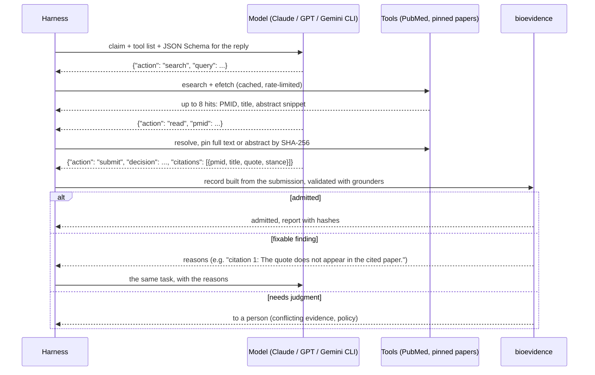
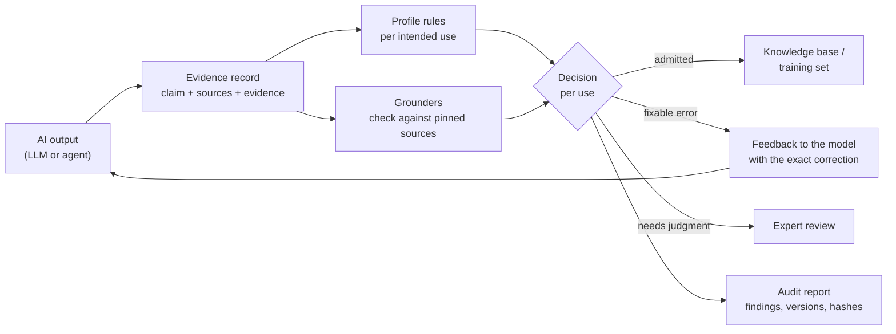

# BioAI Evidence Validator

[](https://github.com/NingyuSUN/bioai-evidence-validator/actions/workflows/ci.yml)
[](https://pypi.org/project/bioai-evidence-validator/)
[](https://github.com/NingyuSUN/bioai-evidence-validator/blob/main/pyproject.toml)
[](https://github.com/NingyuSUN/bioai-evidence-validator/blob/main/LICENSE)
[](https://colab.research.google.com/github/NingyuSUN/bioai-evidence-validator/blob/main/examples/quickstart.ipynb)
[](https://ningyusun.github.io/bioai-evidence-validator/)

**A validation layer for AI-assisted biological curation: let models do the routine work, and send
experts only the records that need them.**

LLMs and agents now extract claims from papers, cite the literature and annotate single-cell clusters.
Their output looks right, and it often is not. Some typical errors:
- a Cell Ontology ID that names a different cell type;
- a real PMID that belongs to an unrelated paper;
- a quote that appears nowhere in the paper.

Bioevidence checks every AI-produced record against pinned sources and reference releases, and decides,
for each intended use, whether it is **admitted**, needs **review**, or is **rejected**. Errors the model
can fix go back to it with the exact correction; findings that need judgment go to a person. Every claim
below is measured on real data with six models from Anthropic, OpenAI and Google.


## Results at a glance

| Experiment | The model alone | With bioevidence |
|---|---|---|
| **Single-cell cell-type annotation**: 6 models × 46 held-out clusters, protocol frozen before the run | 62 of 276 answers (22%) carry a Cell Ontology ID that does not match its label, e.g. "Paneth cell" filed under the ID of a pigment cell | No such answer admitted. In the feedback loop, answers compatible with the authors' term rise from **176 to 205**, wrong or invalid fall from 36% of answers to 20% of those admitted, and 8% go to a person |
| **Literature claims without a source**: 6 models × 18 CIViC claims | 38 of 50 answers cite an invalid paper or quote; 28 of 66 citations are real PMIDs of unrelated papers | 3 answers admitted, all with verified citations and the right decision |
| **Literature agent with PubMed tools**: 108 episodes | 8 of 77 first answers misquote their papers | 0 of 73 admitted answers carry an invalid citation; feedback rescues answers a plain gate would lose |
| **ClinVar germline classifications**: 5,026 variants, 2023 → 2026 | Schema-only checks admit 160 of 160 injected faults | 0 of 160 admitted; variants held back for a dissenting submission were 4–5× more likely to be reclassified three years later |

What it cannot do, also measured:
- **Semantic errors with valid identifiers and real evidence still get through.** Examples are a memory T
  cell called naive, or an ILC3 called a Th17 cell: 20% of admitted single-cell annotations disagree with
  the authors' term, part of it label noise.
- **One check failed external validation.** A check built from Cell Ontology marker definitions, with
  thresholds set on development data, flagged errors no better than chance on six new studies. Fed back to
  the models, it turned 15 correct answers into wrong ones. The check is kept as experimental, and the
  cause (protein definitions that do not hold for transcripts) is documented.

Full protocols and numbers: [LLM benchmark](https://github.com/NingyuSUN/bioai-evidence-validator/blob/main/evaluation/llm_benchmark/README.md) ·
[single-cell case](https://github.com/NingyuSUN/bioai-evidence-validator/blob/main/examples/singlecell_celltype/README.md) ·
[ClinVar case](https://github.com/NingyuSUN/bioai-evidence-validator/blob/main/examples/clinvar_germline/README.md).

## End to end: LLM → tool calling → structured output → evaluation → failure handling

The [agent benchmark](https://github.com/NingyuSUN/bioai-evidence-validator/blob/main/evaluation/llm_benchmark/agent_loop.py)
runs the whole chain with every model:
- the harness, not the model's CLI, executes the tools, so each step is logged;
- each model reply must match a JSON Schema;
- each submission is validated by bioevidence before anything is admitted.


```mermaid
sequenceDiagram
    participant H as Harness
    participant M as Model (Claude / GPT / Gemini CLI)
    participant T as Tools (PubMed, pinned papers)
    participant B as bioevidence
    H->>M: claim + tool list + JSON Schema for the reply
    M-->>H: {"action": "search", "query": ...}
    H->>T: esearch + efetch (cached, rate-limited)
    T-->>H: up to 8 hits: PMID, title, abstract snippet
    M-->>H: {"action": "read", "pmid": ...}
    H->>T: resolve, pin full text or abstract by SHA-256
    M-->>H: {"action": "submit", "decision": ..., "citations": [{pmid, title, quote, stance}]}
    H->>B: record built from the submission, validated with grounders
    alt admitted
        B-->>H: admitted, report with hashes
    else fixable finding
        B-->>H: reasons (e.g. "citation 1: The quote does not appear in the cited paper.")
        H->>M: the same task, with the reasons
    else needs judgment
        B-->>H: to a person (conflicting evidence, policy)
    end
```

A real run from the committed results: Claude Haiku 4.5, asked whether VHL mutation predicts response to anti-VEGF
antibodies in renal cell carcinoma.

| Step | Model output (schema-validated JSON) | Harness and bioevidence |
|---|---|---|
| 1 | `search`: "VHL mutation renal cell carcinoma anti-VEGF response" | PubMed returns up to 8 hits with titles and abstract snippets |
| 2 | `read`: PMID 28103578 | The paper is resolved and pinned by SHA-256; its text is returned |
| 3 | `submit`: decision `does_not_support`, one citation with a 67-word quote | **Rejected.** BEV017: the quote does not appear in the cited paper. BEV020: no verified quote, as the profile requires. The reasons go back to the model |
| 4 | `submit`: the same decision with three shorter quotes from the same paper | All three are found in the pinned text, so the record is **admitted**. Its decision matches CIViC's |

The same loop corrects identifiers in single-cell annotation. Claude Haiku 4.5 labeled a pancreatic cluster
"pancreatic delta cell" but gave the ID `CL:0002335`, which is a brown preadipocyte. The feedback it received:

> object label: The label 'pancreatic delta cell' is not the name of CL:0002335 ('brown preadipocyte').
> 'pancreatic delta cell' is the name of CL:0000173 (pancreatic D cell).

Its second answer, `CL:0000173`, was admitted and is exactly the authors' annotation.

**Failure handling**, each in the code and exercised in the runs:

| Failure | Detected by | Handling |
|---|---|---|
| Malformed reply, or one that violates the schema | JSON Schema enforced by the CLI, then `check_step` / `check_answer` | One retry; then the step is logged as failed and the episode continues |
| The CLI uses its own tools (web, shell) | Tools are disabled where the CLI allows; otherwise tool events in its output stream | The answer is discarded and the call retried; the prompt also forbids tools |
| CLI error, timeout, no structured output | Subprocess timeout and output parsers | Logged per step and kept in the results (4 of 601 steps in the agent pilot) |
| PubMed rate limits, server errors | `Library.fetch` | Exponential backoff on 429 and 5xx, a response cache, a 100 MB download cap |
| Wrong paper, retracted paper, quote not in the paper | `LiteratureGrounder` (BEV016, BEV017, BEV019) | The reason goes back to the model; at most three submissions |
| ID of another term, obsolete term, gene alias | `OntologyGrounder`, `GeneGrounder` (BEV017, BEV023, BEV024) | The reason goes back, naming the correct identifier |
| The model's own evidence contradicts its answer | BEV004 | Sent to a person; not fed back, so the model is never asked to hide it |
| A revision drops evidence that was verified | `feedback.carry` | The verified evidence is carried into the revision |
| Still not admitted after the last round | `feedback.revise` | Sent to a person |
| A long batch is interrupted | One file per episode | A rerun skips finished episodes (used when a 486-episode run hit a time limit) |

## How it works


```mermaid
flowchart LR
    A["AI output<br/>(LLM or agent)"] --> R["Evidence record<br/>claim + sources + evidence"]
    R --> P["Profile rules<br/>per intended use"]
    R --> G["Grounders<br/>check against pinned sources"]
    P --> D{"Decision<br/>per use"}
    G --> D
    D -->|admitted| K["Knowledge base /<br/>training set"]
    D -->|fixable error| F["Feedback to the model<br/>with the exact correction"]
    F --> A
    D -->|needs judgment| H["Expert review"]
    D --> L["Audit report<br/>findings, versions, hashes"]
```

- **Records:** a claim (subject, predicate, object, scope) with the sources it rests on and typed evidence
  items. They are validated against a LinkML schema.
- **Profiles:** each profile states, per use, which evidence a claim needs before it is admitted. For
  example, LLM-extracted evidence may be enough for a research summary, while a knowledge base requires a
  human's acceptance. Profiles are YAML, so a new domain needs no engine changes.
- **Grounders:** they recompute what a record only asserts from pinned, content-addressed snapshots:

  | Grounder | Checks |
  |---|---|
  | Literature | PMID/DOI resolution, retraction, title, and every quote against open full text or the abstract |
  | Ontology | the term exists, is current, matches its label and is of the right kind (e.g. a cell type) |
  | Genes / variants | HGNC approved symbols, previous symbols and aliases; HGVS form, RefSeq version, genome build |
  | Tables | a cited data row exists with the values claimed (e.g. a marker gene of this cluster) |
  | Reference resources | a curated reference contradicts the claim (review only) |
  | Ontology definitions | measurements contradict a marker the claimed term is defined by (experimental) |

- **Feedback loop:** `feedback.revise` wraps any model or agent.
  - Fixable findings go back as precise reasons.
  - Conflicts and policy decisions go to a person unchanged.
  - Verified evidence cannot be withdrawn in a revision, so an agent cannot drop the evidence against
    its own answer.
- **Audit:** every report records the input, schema and profile hashes and versions. There are 26
  documented rule codes, each with a fixed severity.

## What this project demonstrates

- **Rigorous evaluation of LLMs and agents.**
  - Six models from three vendors, called through their CLIs with structured output, plus a tool-using
    agent with PubMed access.
  - Protocols are designed on pilot data and committed to git before the held-out and external splits are
    run.
  - Scoring is ontology-aware, with Wilson intervals.
  - Negative results are reported, including the run where a new check made things worse.
- **Biological data engineering.**
  - Single-cell marker statistics computed from raw counts (CELLxGENE).
  - The Cell Ontology, including its disjointness axioms and logical definitions, HGNC, NCBI assemblies,
    ClinVar submissions, CIViC evidence and PMC JATS full text.
  - All sources are pinned by SHA-256, with licences and attribution.
- **Production-quality software.**
  - A typed Python package on PyPI, with CLI exit codes for pipelines and a GitHub Action for CI.
  - Test coverage around 98%, with CI on Linux and Windows for Python 3.11–3.14.
  - A documentation site, and byte-for-byte replay of every committed benchmark table.
- **Designing for trust, not only accuracy.**
  - Decisions are made per intended use, with a measured trust boundary (controlled faults and forged
    sources).
  - Only facts are fed back to a model; anything that needs judgment goes to a person.

## Quickstart

```bash
pip install bioai-evidence-validator
bioevidence validate examples/literature_claim/llm_only.json --profile literature-claim   # exit 2: review required
```

From version 0.8.0 the package also includes the literature, ontology, gene, variant, table and
reference grounders, and the feedback loop. For example, to check a cell-type annotation against a pinned
Cell Ontology release and the HGNC gene set:

```bash
bioevidence validate record.json --ontology cl.obo --term-root cell_type=CL:0000000 --genes hgnc_complete_set.txt
```

Wrap a model in the feedback loop:

```python
from pathlib import Path

from bioevidence_validator.engine import RecordValidator
from bioevidence_validator.feedback import revise
from bioevidence_validator.identifiers import GeneGrounder, Genes, Ontology, OntologyGrounder

validator = RecordValidator(profile="general", grounders=[
    OntologyGrounder([Ontology.from_obo(Path("cl.obo").read_bytes())], roots={"cell_type": ["CL:0000000"]}),
    GeneGrounder(Genes.from_hgnc(Path("hgnc_complete_set.txt").read_bytes())),
])

def propose(feedback: list[str]) -> dict | None:
    """Ask your model for a record; on later rounds, include the feedback in the prompt."""
    ...

attempts = revise(propose, validator, rounds=3)
print(attempts[-1].report["overall_status"])   # admitted, review_required or rejected
```

Exit codes: **0** admitted, **1** rejected, **2** review required, **3** input or configuration error.

To check records in a pull request, use the GitHub Action:

```yaml
- uses: NingyuSUN/bioai-evidence-validator@v0.8.0
  with:
    files: records/**/*.yaml
    format: draft
    profile: literature-claim
    fail-on: review
```

More: [draft format](https://github.com/NingyuSUN/bioai-evidence-validator/blob/main/docs/DRAFTS.md) (state each fact once, build the full record) ·
[create a profile](https://github.com/NingyuSUN/bioai-evidence-validator/blob/main/docs/PROFILES.md) ·
[engineering contract and rule codes](https://github.com/NingyuSUN/bioai-evidence-validator/blob/main/docs/ENGINEERING.md) ·
[documentation site](https://ningyusun.github.io/bioai-evidence-validator/).

## Real-data cases

| Case | Data | What it shows |
|---|---|---|
| [Single-cell cell-type annotation](https://github.com/NingyuSUN/bioai-evidence-validator/blob/main/examples/singlecell_celltype/README.md) | 12 CELLxGENE datasets (151 clusters), Cell Ontology, HGNC, HuBMAP ASCT+B | Identifier hallucination caught for every model; a feedback loop that improves annotations; a pre-registered external test of a new check that failed |
| [LLM literature benchmark](https://github.com/NingyuSUN/bioai-evidence-validator/blob/main/evaluation/llm_benchmark/README.md) | CIViC claims, PMC open-access papers, six models | Invented citations blocked; an agent loop with stances and a "conflicting" outcome; semantic checks |
| [CIViC literature grounding](https://github.com/NingyuSUN/bioai-evidence-validator/blob/main/examples/civic_literature/README.md) | CC BY / CC0 full texts and retracted papers, pinned from PMC | Quotes, titles and retractions verified against pinned bytes |
| [ClinVar germline, three years later](https://github.com/NingyuSUN/bioai-evidence-validator/blob/main/examples/clinvar_germline/README.md) | 5,026 variants from the 2023-09 release, followed to 2026-09 | The profile reproduces NCBI's review status in 98–99% of decisions; held-back variants were less stable; a closed trust boundary |
| [VBO canine name mapping](https://github.com/NingyuSUN/bioai-evidence-validator/blob/main/examples/vbo_canine/README.md) | A pinned public ontology release | 0 of 160 controlled faults and 0 of 48 forged sources admitted |


## Limits

- **Admission is not truth.** It means the record meets the selected profile: its evidence exists in the
  pinned sources and satisfies the use's rules. It does not mean the biological claim is true.
- **The references are curators' and authors' labels, not independent expert labels.** A blinded
  [expert-review kit](https://github.com/NingyuSUN/bioai-evidence-validator/tree/main/evaluation/clinvar_review)
  is ready (#23).
- **Sample sizes are small.** The literature benchmarks are pilot-scale (18 claims). Each single-cell split
  was run once.
- **Not for clinical use.**

## Roadmap

Tracked in the [AI validation roadmap](https://github.com/NingyuSUN/bioai-evidence-validator/blob/main/docs/AI_VALIDATION_ROADMAP.md) (#26):
- expert review of the benchmark cases (#23);
- calibrated triage and audit sampling of admitted records, to measure what still gets through (#24);
- one-command reproduction of every benchmark, a funnel figure, and a validation dossier for release
  0.8.0 (#25).

## Contributing and citing

Bug reports, domain profiles and new benchmarks are welcome. See
[CONTRIBUTING.md](https://github.com/NingyuSUN/bioai-evidence-validator/blob/main/CONTRIBUTING.md) and
issues labelled [`good first issue`](https://github.com/NingyuSUN/bioai-evidence-validator/labels/good%20first%20issue);
report security problems as described in [SECURITY.md](https://github.com/NingyuSUN/bioai-evidence-validator/blob/main/SECURITY.md).
To cite this toolkit, use [`CITATION.cff`](https://github.com/NingyuSUN/bioai-evidence-validator/blob/main/CITATION.cff)
(GitHub's "Cite this repository" button).

Author: Ningyu Sun ([@NingyuSUN](https://github.com/NingyuSUN)) ·
[Changelog](https://github.com/NingyuSUN/bioai-evidence-validator/blob/main/CHANGELOG.md) ·
[Standards alignment](https://github.com/NingyuSUN/bioai-evidence-validator/blob/main/docs/STANDARDS.md) ·
[Error taxonomy](https://github.com/NingyuSUN/bioai-evidence-validator/blob/main/docs/ERROR_TAXONOMY.md) ·
[Design case study](https://github.com/NingyuSUN/bioai-evidence-validator/blob/main/docs/CASE_STUDY.md) ·
[Apache-2.0](https://github.com/NingyuSUN/bioai-evidence-validator/blob/main/LICENSE)
