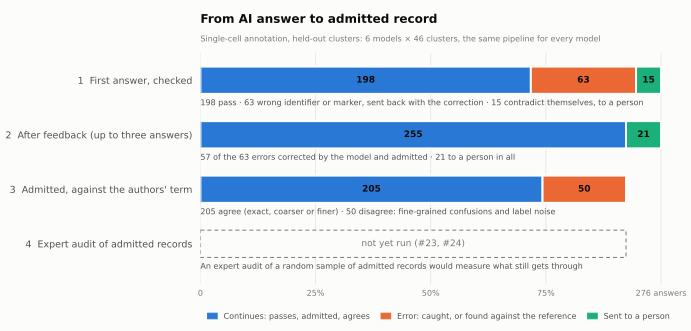

# Validation dossier: AI-assisted curation behind bioevidence

This dossier follows the seven steps of the risk-based credibility assessment framework in FDA's draft
guidance *Considerations for the Use of Artificial Intelligence to Support Regulatory Decision-Making for Drug
and Biological Products* (January 2025). It borrows the structure only. It is **not a regulatory submission**,
it has not been reviewed by FDA, and the system is **not for clinical use**.

Every number comes from the committed results and can be regenerated offline with
`uv run --frozen --with matplotlib==3.11.2 python tools/reproduce.py`. Intervals are Wilson 95%.
State: release 0.8.0, October 2026.

## Summary

| Claim | Evidence | Status for the context of use |
|---|---|---|
| Admitted records carry no invalid identifier or citation | 0 of 1,384 admitted AI outputs across five experiments (upper bound 0.3%); models alone produced such errors in 10–76% of answers | **Established** |
| The feedback loop corrects fixable errors without hiding evidence | Single-cell held-out: 57 of 63 answers with identifier or marker errors corrected and admitted; verified evidence cannot be withdrawn | **Established** |
| Admitted records are semantically correct | 19.6% [15.2, 24.9] of admitted single-cell annotations disagree with the authors' term. Part of this is label noise. The audit tool is ready and was checked in a dry run; no expert audit yet | **Not established** |
| Default routing rests on signals that predict errors | BEV004 answers were wrong 82% vs 33% (held-out) and 70% vs 38% (external); the opt-in signals (semantic cues, ASCT+B, definitions) showed no such effect and stay off | **Established** for BEV004 |
| Routing load is workable | 7.6% [5.0, 11.3] of single-cell annotations sent to a person (held-out) | **Plausible**, one run |
| A new semantic check (Cell Ontology definitions) helps | No better than chance on external data, and harmful when fed back | **Refuted**; kept experimental |

## 1. Question of interest

Can records produced by general-purpose LLMs and agents be admitted to a research knowledge base without an
expert reviewing each one, and which records must an expert see? Two kinds of records are in scope:
- cell-type annotations of single-cell clusters;
- literature evidence for cancer-variant claims.

## 2. Context of use

- **The system assessed** is a model and bioevidence together, because the question concerns the records that
  are admitted.
  - **Proposer:** one of six general-purpose models, or an agent that searches PubMed, proposes a record. A
    record is a claim with the evidence it rests on: marker genes of a cluster, or quotes from papers.
  - **Validator:** bioevidence checks the record against pinned sources and reference releases, under a
    profile for the intended use.
  - **Feedback:** fixable findings go back to the proposer, for up to three answers.
  - **Admission:** an admitted record enters the knowledge base. A record with conflicting evidence, or still
    failing after the last round, goes to a curator.
- **Intended use:** research summaries and a research knowledge base.

  Out of scope:
  - clinical interpretation;
  - patient care;
  - regulatory decisions;
  - training data, unless a human accepts each record. The profiles require that.
- **Other evidence in the decision:** curators decide every routed record. Admitted records are not reviewed by
  anyone today; that is the residual risk this dossier measures.
- **Models:**

  | Key | Model | Tier | Runs through |
  |---|---|---|---|
  | claude-opus | `claude-opus-5-5` | frontier | Claude Code 2.1.283 |
  | gpt-astra | `gpt-6-astra` | frontier | codex-cli 0.153.4 |
  | gemini-pro | `gemini-3.1-pro-high` | frontier | Antigravity 1.2.13 |
  | claude-haiku | `claude-haiku-4-5-20251001` | fast | Claude Code 2.1.283 |
  | gpt-luna | `gpt-5.6-luna` | fast | codex-cli 0.153.4 |
  | gemini-flash | `gemini-3.8-flash-medium` | fast | Antigravity 1.2.13 |

  Every reply must match a JSON Schema, and the harness, not the model's CLI, executes the tools. Bioevidence
  must not depend on which model proposes, so all six are evaluated with one pipeline.

## 3. Model risk

The guidance combines **model influence**, how much the output drives the decision, with **decision
consequence**, the impact of a wrong decision.

- **Influence is high for admitted records:** nothing else checks them. It is low for routed records, where a
  curator decides.
- **Consequence is moderate in this context.** A wrong cell type or citation in a research knowledge base
  spreads to analyses, summaries and possibly to training sets, but it does not reach patients. Outside the
  context (clinical use) it would be high.
- **Risk is therefore medium.** It calls for:
  - evaluation on data not used to design the system;
  - protocols fixed before results are seen;
  - negative controls;
  - full reproducibility;
  - a measure of what still gets through. That last one needs an expert audit, which has not been done. The
    procedure and its statistics are ready (`bioevidence review audit-sample`, `audit-score`), and a dry run
    with the authors' labels as a stand-in recovered the census rate (19.6%) inside its interval.

## 4. Credibility assessment plan

| Element | What was planned and done |
|---|---|
| Sources | Pinned by SHA-256, with licences and attribution: <ul><li>12 CELLxGENE datasets (CC BY 4.0)</li><li>the Cell Ontology 2026-06-08 (CC BY 4.0)</li><li>HGNC 2026-09-30 (CC0)</li><li>HuBMAP ASCT+B (CC BY 4.0)</li><li>CIViC evidence (CC0)</li><li>PMC open-access full texts (CC BY / CC0): 120 for the literature case, 50 more for extraction</li><li>the Disease Ontology 2026-09-30 (CC0)</li><li>a ClinVar 2023-09 sample, followed to 2026-09</li></ul> |
| Reference standards | <ul><li>Single-cell: each study's own author annotations, compared through the ontology (exact, coarser, finer or wrong)</li><li>Literature: the direction CIViC records for the claim</li><li>ClinVar: NCBI's review status, and what happened to each classification three years later</li></ul>No independent expert labels yet (#23) |
| Splits | <ul><li>Single-cell: a pilot (24 clusters) for design; a held-out test (46 clusters, same datasets); an external split (81 clusters from six other studies)</li><li>Literature: pilot only (18 claims); its held-out set (92 claims) is built but not run</li><li>Extraction: a pilot (10 papers) and a test split (40 papers), none used by an earlier benchmark</li></ul> |
| Protocol freezes | Each protocol was committed before the split it was run on: <ul><li>protocol 2 at `d134d1e`, before the held-out test</li><li>protocol 3 at `c86d5d4`, before the external split</li><li>the extraction protocol at `c74af1f`, before its test split</li></ul>Protocol 1 was fixed before the pilot and committed with its results |
| Metrics | Defined in the scoring code before the runs: <ul><li>identifier or citation errors in the model's answers, and in what is admitted</li><li>agreement with the reference</li><li>wrong answers admitted</li><li>records sent to a person</li></ul>Each is reported per model and pooled |
| Negative controls | <ul><li>ClinVar: 160 controlled faults and 32 trust-boundary forgeries</li><li>VBO: 160 faults and 48 forgeries</li><li>CIViC: retracted papers, PMIDs that do not exist, misattributed quotes</li></ul> |
| Acceptance criteria | **Not set numerically in advance.** This is a gap; section 7 proposes criteria for the next evaluation |
| Reproducibility | `tools/reproduce.py` regenerates every result set and figure (22 steps). CI runs it on every change |

## 5. Execution

| Run | Scope | Records | Protocol |
|---|---|---|---|
| Literature pilots | 6 models × 18 CIViC claims: with the source, plain questions (1a, 1b), semantic review | 108 answers each | fixed before each run |
| Literature agent | 6 models × 18 claims, PubMed tools, feedback; with and without stances | 108 episodes each | fixed before each run |
| Single-cell pilot | 6 models × 24 clusters | 144 episodes | protocol 1 |
| Single-cell held-out | 6 models × 46 clusters | 276 episodes | protocol 2 (`d134d1e`) |
| Single-cell external | 6 models × 81 clusters, six new studies | 486 episodes | protocol 3 (`c86d5d4`) |
| Extraction pilot | 6 models × 10 papers, claims extracted without a given claim | 60 episodes, 167 claims | first harness |
| Extraction test | 6 models × 40 papers | 240 episodes, 714 claims | frozen at `c74af1f` |
| ClinVar, VBO, CIViC cases | Deterministic replays from pinned sources | 5,026 + 72 + controls | engine and grounders |

## 6. Results

### 6.1 Identifier and citation integrity

| Experiment | Model's answers with an invalid identifier or citation | Admitted with one |
|---|---|---|
| Single-cell held-out | 63/276, 22.8% [18.3, 28.1] | 0/255 [0, 1.5] |
| Single-cell external | 70/479, 14.6% [11.7, 18.1] | 0/390 [0, 1.0] |
| Literature, claim only, no source | 38/50, 76.0% [62.6, 85.7] | 0/3 [0, 56.1] |
| Literature agent with PubMed | 8/77, 10.4% [5.4, 19.2] | 0/73 [0, 5.0] |
| Extraction from full papers (test split) | 198/714, 27.7% [24.6, 31.1] | 0/663 [0, 0.6] |
| Pooled | | **0/1,384 [0, 0.3]** |

In single-cell annotation, the typical error is an ID that belongs to another term. For example, "pancreatic
delta cell" was given the ID of a brown preadipocyte. Error rates differ by model: on the held-out split,
Claude Haiku 4.5 had 23 of 46 answers with an identifier or marker error, GPT-5.6-Luna 16, and Claude Opus 5.5 4.
The outcome after bioevidence does not differ by model.

Deterministic controls:

| Control | Schema only | Validator | Validator with grounding |
|---|---|---|---|
| ClinVar controlled faults | 160/160 admitted | 0/160 [0, 2.3] | 0/160 |
| ClinVar trust-boundary forgeries | 32/32 | 32/32 | 0/32 [0, 10.7] |
| VBO controlled faults / forgeries | 160/160 / 48/48 | 0/160 / 48/48 | 0/160 / 0/48 |

### 6.2 Agreement with the reference (single-cell held-out, protocol 2)

| Configuration | Compatible with the authors' term | Wrong or invalid | Sent to a person |
|---|---|---|---|
| Model alone | 176/276, 63.8% [57.9, 69.2] | 100/276, 36.2% [30.8, 42.1] | 0 |
| Gate | 161 admitted | 37/198 admitted, 18.7% [13.9, 24.7] | 78 |
| Feedback loop | 205/276, 74.3% [68.8, 79.1] | 50/255 admitted, **19.6% [15.2, 24.9]** | 21, 7.6% [5.0, 11.3] |

What the remaining disagreements are:
- 7 call a duodenal cluster that the authors label "B cell" a plasma cell. Its top markers are JCHAIN and MZB1,
  so this is probably label noise.
- 11 call a "mesenchymal cell" a fibroblast or stellate cell.
- The rest are fine-grained confusions: NK T against gamma-delta T cells, memory against naive CD4 T cells.

On the external split the base rates are higher. Wrong or invalid annotations fell from 42.0% [37.6, 46.4] of
the models' answers to 37.9% [33.3, 42.9] of those admitted. That run used protocol 3, whose definition check is
discussed in 6.3.

In the literature agent (pilot), stances and a "conflicting" outcome reduced wrong decisions that were admitted
from 15/108, 13.9% [8.6, 21.7], to 10/108, 9.3% [5.1, 16.2]. Another 10 records went to an expert as
conflicting.

### 6.3 Negative result: the Cell Ontology definition check

The check compares the markers a claimed term is defined to have or lack with the cluster's measurements. Its
thresholds were set on the development datasets, where 70% of the answers it flagged were wrong.

On the external split, the answers it flagged were wrong 46.6% [36.5, 56.9] of the time, against a base rate of
42.0%: no better than chance. The cause is protein definitions that do not hold for transcripts:
- mast cell CCR3 and neutrophil CEACAM8 are not detected;
- NK cells are defined as lacking CD3 epsilon, but their CD3E transcripts are detected.

Fed back in the loop, its findings turned 15 correct answers into wrong ones. Compatible answers in the loop
(242 of 486) fell below the model alone (278).

### 6.4 Deviations from the plan

- **Protocols changed between splits, never within one.** After the pilot, the ASCT+B cross-check was removed,
  because its biomarker lists are not specificity statements, and the request for contradicting markers was
  narrowed. Protocol 2 was then frozen.
- **One protocol detail changed before any results.** Gemini models first tried to use their own tools. The
  prompt gained "answer from what you know" before the pilot.
- **One run was resumed.** The external run hit a time limit at 321 of 486 episodes and was resumed. Episodes are
  independent, and none was repeated.
- **The extraction test ran Claude on two accounts.** Its WSL Claude Code install hit its session limit after 15
  of 80 Claude episodes; the quota guard left the rest unrun, and they ran on the Windows install. The model
  versions are the same, and each episode records its install. One Gemini 3.8 Flash extraction failed twice and
  is counted as failed.
- **The extraction pilot ran with the first harness.** It led to four changes before the freeze, listed in the
  [extraction case](benchmarks/civic-extraction.md).
- **Two planned evaluations have not been done.** The literature held-out set was built but not run, and no expert
  review or audit of admitted records has been done (#23). The audit tooling is in place (#24).

## 7. Adequacy for the context of use

- **Identifier and citation integrity: adequate.** No invalid identifier or citation was admitted in 1,384
  admitted AI outputs, for every model. The check is deterministic and independent of the model that proposes, so the
  result transfers to new models as long as the pinned references cover the records.
- **Semantic correctness: not established.** About one admitted single-cell annotation in five disagrees with the
  authors' term. Part of that is label noise, but how much cannot be known without experts. Until an audit
  measures it, admitted records are fit for research summaries that state this error rate, and not for uses that
  depend on fine cell-type distinctions.
- **Literature direction: indicative only.** It rests on an 18-claim pilot.
- **Clinical or regulatory use: not adequate,** and outside the context of use.

Proposed acceptance criteria for the next evaluation, to be fixed before it is run:
1. Admitted records with an invalid identifier or citation: upper 95% bound below 1%. Met today.
2. Semantic error of admitted records, measured by an expert audit of a random sample: upper 95% bound below a
   threshold set per use, for example 10% for research summaries.
3. Records sent to a person: at most 20%.

## 8. Life-cycle maintenance

- **Model change.** When a model or its version changes, re-run the held-out and external splits with the frozen
  protocol, and compare per model. The integrity result should not move; the semantic result can.
- **Reference change.** A new Cell Ontology, HGNC or ClinVar release changes the pinned snapshots. Re-run
  `tools/reproduce.py` and the affected splits, and keep the earlier snapshots for comparison.
- **Monitoring in use.** Audit a random sample of admitted records on a schedule with
  `bioevidence review audit-sample` and `audit-score` (#24), and report the audited
  error rate with its interval next to the figures above.

## Sources

- [LLM benchmark](benchmarks/llm-benchmark.md): literature pilots, scenarios 1–2b, semantic checks, scenario 3.
- [Single-cell case](benchmarks/singlecell.md), [ClinVar case](benchmarks/clinvar.md),
  [VBO case](benchmarks/vbo-canine.md), [CIViC literature case](benchmarks/civic-literature.md).
- [Engineering contract](ENGINEERING.md): rule codes, grounders, the feedback loop, reproduction.
- [AI validation roadmap](AI_VALIDATION_ROADMAP.md) and [error taxonomy](ERROR_TAXONOMY.md).
