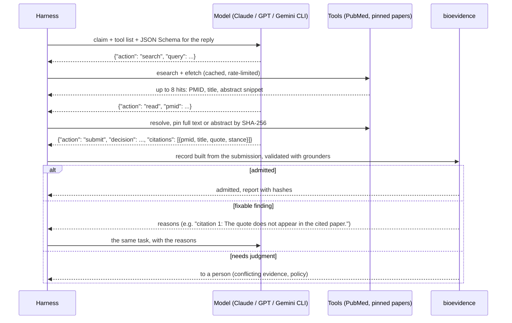

# BioAI Evidence Validator

**A validation layer for AI-assisted biological curation: let models do the routine work, and send
experts only the records that need them.**

LLMs and agents now extract claims from papers, cite the literature and annotate single-cell clusters.
Their output looks right, and it often is not. Some typical errors:
- a Cell Ontology ID that names a different cell type;
- a real PMID that belongs to an unrelated paper;
- a quote that appears nowhere in the paper.

Bioevidence checks every AI-produced record against pinned sources and reference releases, and decides,
for each intended use, whether it is **admitted**, needs **review**, or is **rejected**. Errors the model
can fix go back to it with the exact correction; findings that need judgment go to a person. Every claim
below is measured on real data with six models from Anthropic, OpenAI and Google.


```bash
pip install bioai-evidence-validator
```

From version 0.8.0 the package includes the grounders and the feedback loop described below.
Try it without installing anything:
[quickstart notebook on Colab](https://colab.research.google.com/github/NingyuSUN/bioai-evidence-validator/blob/main/examples/quickstart.ipynb).

## Results at a glance

| Experiment | The model alone | With bioevidence |
|---|---|---|
| **[Single-cell cell-type annotation](benchmarks/singlecell.md)**: 6 models × 46 held-out clusters, protocol frozen before the run | 62 of 276 answers (22%) carry a Cell Ontology ID that does not match its label | No such answer admitted. In the feedback loop, answers compatible with the authors' term rise from **176 to 205**, wrong or invalid fall from 36% of answers to 20% of those admitted, and 8% go to a person |
| **[Literature claims without a source](benchmarks/llm-benchmark.md)**: 6 models × 18 CIViC claims | 38 of 50 answers cite an invalid paper or quote; 28 of 66 citations are real PMIDs of unrelated papers | 3 answers admitted, all with verified citations and the right decision |
| **[Literature agent with PubMed tools](benchmarks/llm-benchmark.md)**: 108 episodes | 8 of 77 first answers misquote their papers | 0 of 73 admitted answers carry an invalid citation; feedback rescues answers a plain gate would lose |
| **[ClinVar germline classifications](benchmarks/clinvar.md)**: 5,026 variants, 2023 → 2026 | Schema-only checks admit 160 of 160 injected faults | 0 of 160 admitted; variants held back for a dissenting submission were 4–5× more likely to be reclassified three years later |

What it cannot do, also measured:
- **Semantic errors with valid identifiers and real evidence still get through.** For example, a memory T
  cell called naive: 20% of admitted single-cell annotations disagree with the authors' term, part of it
  label noise.
- **One check failed external validation.** A check built from Cell Ontology marker definitions flagged
  errors no better than chance on six new studies. Fed back to the models, it turned 15 correct answers
  into wrong ones. It is kept as experimental, with the cause documented in the
  [engineering contract](ENGINEERING.md#ontology-definitions-as-checks).

## End to end: LLM → tool calling → structured output → evaluation → failure handling

The agent benchmark runs the whole chain with every model:
- the harness, not the model's CLI, executes the tools, so each step is logged;
- each model reply must match a JSON Schema;
- each submission is validated by bioevidence before anything is admitted.



A real run from the committed results: Claude Haiku 4.5, asked whether VHL mutation predicts response to anti-VEGF
antibodies in renal cell carcinoma.

| Step | Model output (schema-validated JSON) | Harness and bioevidence |
|---|---|---|
| 1 | `search`: "VHL mutation renal cell carcinoma anti-VEGF response" | PubMed returns up to 8 hits with titles and abstract snippets |
| 2 | `read`: PMID 28103578 | The paper is resolved and pinned by SHA-256; its text is returned |
| 3 | `submit`: decision `does_not_support`, one citation with a 67-word quote | **Rejected.** BEV017: the quote does not appear in the cited paper. BEV020: no verified quote, as the profile requires. The reasons go back to the model |
| 4 | `submit`: the same decision with three shorter quotes from the same paper | All three are found in the pinned text, so the record is **admitted**. Its decision matches CIViC's |

The same loop corrects identifiers in single-cell annotation. Claude Haiku 4.5 labeled a pancreatic cluster
"pancreatic delta cell" but gave the ID `CL:0002335`, which is a brown preadipocyte. The feedback it received:

> object label: The label 'pancreatic delta cell' is not the name of CL:0002335 ('brown preadipocyte').
> 'pancreatic delta cell' is the name of CL:0000173 (pancreatic D cell).

Its second answer, `CL:0000173`, was admitted and is exactly the authors' annotation.

**Failure handling**, each in the code and exercised in the runs:

| Failure | Detected by | Handling |
|---|---|---|
| Malformed reply, or one that violates the schema | JSON Schema enforced by the CLI, then `check_step` / `check_answer` | One retry; then the step is logged as failed and the episode continues |
| The CLI uses its own tools (web, shell) | Tools are disabled where the CLI allows; otherwise tool events in its output stream | The answer is discarded and the call retried; the prompt also forbids tools |
| CLI error, timeout, no structured output | Subprocess timeout and output parsers | Logged per step and kept in the results (4 of 601 steps in the agent pilot) |
| PubMed rate limits, server errors | `Library.fetch` | Exponential backoff on 429 and 5xx, a response cache, a 100 MB download cap |
| Wrong paper, retracted paper, quote not in the paper | `LiteratureGrounder` (BEV016, BEV017, BEV019) | The reason goes back to the model; at most three submissions |
| ID of another term, obsolete term, gene alias | `OntologyGrounder`, `GeneGrounder` (BEV017, BEV023, BEV024) | The reason goes back, naming the correct identifier |
| The model's own evidence contradicts its answer | BEV004 | Sent to a person; not fed back, so the model is never asked to hide it |
| A revision drops evidence that was verified | `feedback.carry` | The verified evidence is carried into the revision |
| Still not admitted after the last round | `feedback.revise` | Sent to a person |
| A long batch is interrupted | One file per episode | A rerun skips finished episodes |

How the checks work, rule by rule: [engineering contract](ENGINEERING.md).

## In one minute

Write the claim as a [draft](DRAFTS.md), build it into a full evidence record, and validate it against a
[profile](PROFILES.md):

```bash
bioevidence build examples/drafts/llm_claim.yaml --output record.json
bioevidence validate record.json --profile literature-claim    # exit 2: review required
```

The evidence came only from LLM extraction, and the `literature-claim` profile does not let a publication
result rest on that alone (`BEV008`). The manually curated version of the same claim is admitted. Exit codes:
**0** admitted, **1** rejected, **2** review required, **3** input or configuration error.

## Where to go next

| I want to… | Read |
|---|---|
| See the AI benchmarks | [LLM benchmark](benchmarks/llm-benchmark.md), [single-cell annotation](benchmarks/singlecell.md) |
| Write records quickly or from LLM output | [Drafts](DRAFTS.md) |
| Encode my domain's admission policy | [Profiles](PROFILES.md), [community profiles](community-profiles.md) |
| Check records in pull requests | [GitHub Action](https://github.com/NingyuSUN/bioai-evidence-validator#quickstart) |
| Know exactly what is checked | [Engineering contract](ENGINEERING.md) |
| Map records to ECO, Biolink or VA-Spec | [Standards alignment](STANDARDS.md) |
| Evaluate on my own project | [Building a gold standard](GOLD_STANDARD.md) |
| See what is next | [AI validation roadmap](AI_VALIDATION_ROADMAP.md) |
| Contribute | [Contributing](contributing.md) |

Not for clinical use. Admission means a record meets the selected profile, not that a biological claim is
true.
