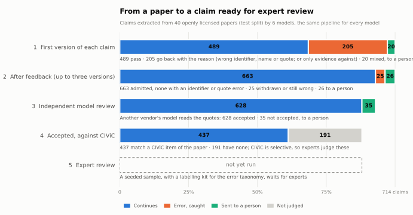

# Real-source case: AI extraction from openly licensed papers

Until this case, the extraction stage was simulated: controlled faults in records that people had written. Here
six models read real papers and extract clinical evidence claims on their own, and every claim goes through
bioevidence's whole chain (#21).

## Sources

- **Papers.** 50 full texts (JATS) from PubMed Central, chosen from the papers CIViC curated that PMC lists
  under **CC BY or CC0**, so they can be redistributed here unchanged.
  - Papers already pinned by the [CIViC literature case](../civic_literature/README.md) are excluded. Those papers
    make up the literature benchmark's test set, which has not been run.
  - The rest were taken in keyed-hash order and kept when they had a body, were not retracted, and were at most
    12,000 words long. All 50 qualifying papers were under that limit; 20 candidates were skipped for licence or
    full text.
  - The first 10 in that order form the **pilot** split, the other 40 the **test** split.
  - Credits are in [sources/ATTRIBUTION.md](sources/ATTRIBUTION.md).
- **CIViC** accepted evidence (CC0), the nightly export pinned by SHA-256. It provides the 106 evidence items
  CIViC curated from these papers, used as the reference.
- **Disease Ontology** release 2026-09-30 (CC0), pinned by SHA-256.
- **HGNC** gene symbols: the snapshot already pinned by the [single-cell case](../singlecell_celltype/README.md),
  by hash.

[prepare_source.py](prepare_source.py) built everything once with NCBI E-utilities (24.7 MB downloaded). The
results are committed as gzip-compressed snapshots named by the SHA-256 of their bytes. Everything after that
runs offline.

## What a model is asked

Each episode shows one model one paper, paragraph by paragraph with the paragraph ids the literature grounder
uses. The model is asked for every clinical evidence claim the paper itself reports, of five kinds:
predictive (sensitivity or resistance), prognostic (poor or better outcome), diagnostic and predisposing.

A claim is the part of a bioevidence draft that carries information:
- **statement:** an HGNC gene (identifier and symbol), one of six predicates, and a Disease Ontology term
  (identifier and name);
- **evidence:** one to three sentences copied verbatim, each with its paragraph id and a direction;
- the variant and the therapies, which are recorded with the claim but are not part of the validated record.

The field names and choices are those of `bioevidence draft-schema` for this [profile](profile.yaml), made strict
for structured output. Fields a model should not decide are added from the pinned corpus: the source, its hash,
the extraction method (`llm_extraction`) and the scope (human).

## The chain

| Stage | What happens | Fed back to the model? |
|---|---|---|
| 1. Extracted | The reply matches the schema; one retry otherwise | — |
| 2. Provenance | `build_record` turns the claim into a record that traces to the pinned paper | Yes |
| 3. Rules | The profile's deterministic rules | Yes |
| 4. Grounding | Each quote is in the paper; the gene is an approved symbol with its own HGNC id; the disease is a current Disease Ontology term with its own name | Yes, with the correct identifier or name when one is known |
| 5. Feedback | One revision call per paper and round: fix or withdraw each claim that was not accepted; at most three versions of a claim | — |
| 6. Model review | A fast model from another vendor reads each admitted claim's quotes without seeing the extractor's reasoning (the [semantic checks'](../../evaluation/llm_benchmark/README.md#semantic-checks-31) reviewer) | No: it routes a claim to a person |
| 7. Human review | The `knowledge_base` use needs a person's acceptance | Not yet run |

A claim whose own evidence includes a sentence against it (BEV004) goes to a person as it is.

The profile's three uses follow the stages:
- `research_summary`: verified quotes;
- `curation_queue`: also an accepting independent review;
- `knowledge_base`: also a person's acceptance.

## Protocol

Frozen at commit `c74af1f` before the test split was run. The pilot could change prompts and code; the test split
was then run once with the committed protocol, and any later change is a new, separately reported version.

The Claude test episodes ran on two Claude Code installs, each with its own account. The first 15 ran on the WSL
install, until its session limit stopped them; the quota guard then left the remaining 65 unrun. Those ran on the
Windows install. The model versions are the same, and each episode records its install (`claude_host`).

- **Models:** Claude Opus 5.5, GPT-6-Astra, Gemini 3.1 Pro, Claude Haiku 4.5, GPT-5.6-Luna and Gemini 3.8 Flash,
  through their CLIs, with tools disabled.
- **Reviewers:** Gemini 3.8 Flash reviews Claude, Claude Haiku 4.5 reviews GPT, and GPT-5.6-Luna reviews Gemini.
- **Prompts and schemas:** as in `evaluation/llm_benchmark/extraction_loop.py`.
- **Scoring:** independent of the grounders.
  - **Integrity:** an admitted claim has an error if its HGNC id is unknown or its label is not the id's symbol,
    its DOID is unknown, obsolete or not a disease, its name is not the term's name or an exact synonym, or a
    quote does not appear in the paper.
  - **Recall against CIViC:** a CIViC item (predictive, prognostic, diagnostic or predisposing) is found when a
    claim names one of its genes and the same Disease Ontology term, a broader one or a narrower one. "Same kind"
    also requires the predicate to match CIViC's evidence type and significance.
  - **Beyond CIViC:** admitted claims with no CIViC counterpart are counted, not called wrong. CIViC is not
    exhaustive, and these claims are what the expert sample is for.
- **Expert labels:** a seeded random sample of claims is labelled with the [error taxonomy](../../docs/ERROR_TAXONOMY.md).
  The sample includes claims stopped at each stage and admitted claims beyond CIViC.

## Results

The test split was run once with the protocol frozen at commit `c74af1f`: 40 papers, six models, 240 episodes
([results](../../evaluation/llm_benchmark/results/extraction-test/summary.md)). One extraction failed: Gemini 3.8
Flash returned no structured output twice for one paper, and the failure is counted.

| Model | Claims | First version: wrong identifier, name or quote | Admitted, no feedback | Admitted, with feedback | Admitted with such an error | CIViC items found (of 87), with feedback |
|---|---:|---:|---:|---:|---:|---:|
| Claude Opus 5.5 | 143 | 4 (3%) | 129 | 133 | 0 | 64 |
| GPT-6-Astra | 133 | 23 (17%) | 97 | 111 | 0 | 55 |
| Gemini 3.1 Pro | 106 | 31 (29%) | 74 | 100 | 0 | 59 |
| Claude Haiku 4.5 | 133 | 64 (48%) | 68 | 124 | 0 | 75 |
| GPT-5.6-Luna | 166 | 62 (37%) | 103 | 163 | 0 | 73 |
| Gemini 3.8 Flash | 33 | 14 (42%) | 18 | 32 | 0 | 30 |
| **All six** | **714** | **198 (28%, 95% CI 25–31%)** | **489** | **663** | **0 [0, 0.6%]** | **77** |

- **A quarter of first versions have an error that a lookup catches.** Most are Disease Ontology names:
  - 113 names that are not the name of the cited DOID;
  - 18 DOIDs that are unknown or obsolete;
  - 65 HGNC identifiers or symbols that do not match;
  - 13 quotes that are not in the paper.

  No such claim was admitted.
- **Feedback recovers most of them.** Admitted claims rise from 489 to 663, still with no identifier or quote
  error. Claude Haiku 4.5 gains the most: 68 → 124 claims, and 44 → 75 CIViC items found.
- **Models differ by an order of magnitude; the result after bioevidence does not.** Claude Opus 5.5 got 3% of
  first versions wrong, Claude Haiku 4.5 48%. Every model's admitted claims have none of these errors.
- **Bioevidence does not add recall.** All six models together already find 77 of CIViC's 87 items. What changes
  is that every admitted claim can be traced to a verbatim sentence at its paragraph, with valid identifiers.
- **Routed or withdrawn.**
  - 26 claims went to a person: their own quotes argued both for and against them.
  - 25 claims were withdrawn by their models.
  - 14 claims cited only evidence against themselves; the paper reported no effect, and all 14 were withdrawn.
- **205 admitted claims (31%) have no CIViC counterpart.** CIViC curates a selection, and many of these claims
  describe preclinical results. They are not called wrong; the expert sample is for them.

- **The independent review accepted 628 of the 663 admitted claims** and sent 35 to a person. The reviewer, a
  fast model of another vendor, sees the claim and its quotes in their paragraphs, not the extractor's reasoning.
  437 of the accepted claims match a CIViC item of their paper.
- **By the reviewer's reading, 300 accepted claims (48%) rest only on cell-line or animal evidence**, and 32 on
  hedged statements.
  - CIViC curates preclinical evidence too, so these are not errors.
  - A knowledge base for clinical questions would need a profile that requires patient evidence; the reviewer's
    reading could route these claims.
  - Models differ here as well. Gemini 3.8 Flash extracted mostly patient-level results (25 of its 31
    accepted claims); Claude Opus 5.5 extracted mostly preclinical ones (78 of 127).

**Expert sample.** [`results/extraction-test/expert_sample`](../../evaluation/llm_benchmark/results/extraction-test/expert_sample)
holds 60 claims drawn with a fixed seed, 20 from each group: stopped by the chain, admitted with no CIViC
counterpart, and admitted matching CIViC. It contains:
- a packet that shows each claim's quotes in their paragraphs, without the model or the stage;
- a labelling sheet that uses the error taxonomy codes;
- a key, which stays with the maintainer.

No expert has labelled it yet.

## What the pilot changed

The pilot (10 papers, 6 models) ran with the first version of the harness. Four things it showed were fixed before
the protocol was frozen. The pilot's results stay as they were run.

- **The disease hint could mislead.** This Disease Ontology release has no term named "glioma". The hint for an
  unknown name then fell back to spelling and suggested "lipoma", and Gemini 3.8 Flash withdrew a correct claim.
  Hints now first offer names that contain all the words ("brain glioma", "mixed glioma"). This holds for every
  ontology grounder.
- **The gene check did not say which identifier was right.** A model told only that HGNC:12815 is XPA guessed the
  neighbouring numbers and never found WWTR1. Claude Haiku 4.5 left 9 claims unfixed or withdrawn this way, Gemini
  3.1 Pro one. The
  message now names the identifier of the symbol, or of the gene a previous symbol or alias now belongs to.
- **Paragraph ids came with brackets.** Models copied ids as shown, "[n397]". The grounder then found no such
  paragraph and searched the whole paper. All the pilot's locators name real paragraphs once the brackets are
  removed, and no admitted quote was elsewhere, so the harness now removes them and each quote is checked at its
  paragraph.
- **A spent quota looked like failed episodes.** All 20 Claude episodes of the first pilot run ended within seconds
  on "You've hit your session limit". They were discarded and rerun. A quota error now stops that model; its
  episodes are left for a later run. All Claude models share one call slot, since they draw on one quota.

## Limits

- **CIViC is a reference, not ground truth.** It curates selected evidence, so a claim it lacks is not an error.
- **Variants and therapies are not validated.** The record is gene-level; checking variants would need HGVS or
  CIViC variant identifiers, which the models are not asked for.
- **Text only.** The models see paragraphs, not figures or tables.
