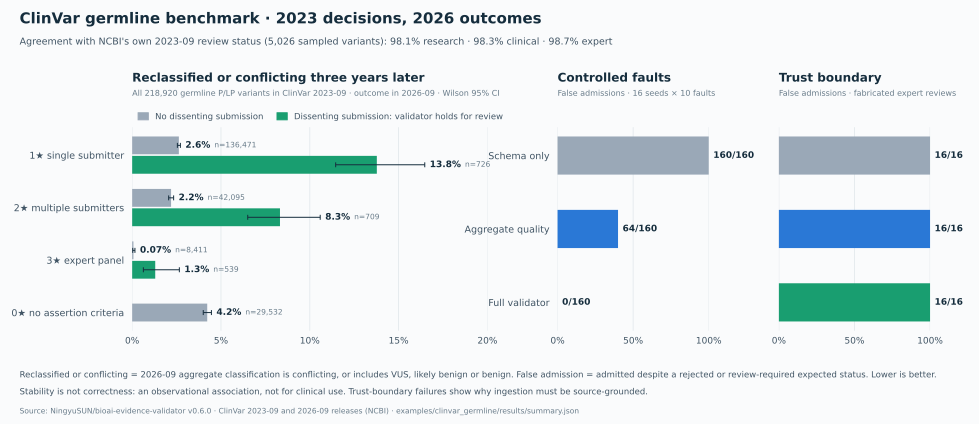

# Real-source case: ClinVar germline classifications, three years later

The second real-data case moves from ontology names to clinical genetics. It asks whether a
**declarative profile** can express a real curation policy from atomic evidence, and whether
the validator's decisions in 2023 correspond to what happened to those classifications by 2026.
It uses the generic engine unchanged; all ClinVar-specific logic is in this folder.

**Not for clinical use.** ClinVar is not intended for direct diagnostic use, and neither is this
benchmark. "Stable for three years" does not mean "correct".

## Run offline

From the repository root after `uv sync --frozen --extra dev` (about 30 seconds):

```bash
uv run python examples/clinvar_germline/run.py --output artifacts/clinvar
```

Runtime needs only the frozen 361 KB sample in `sources/`; its decompressed content hash is
checked before ingestion. Two runs produce byte-identical outputs. Committed
[results](results/summary.md) include `summary.json`, `summary.md` and `divergences.csv`
(every case where the validator and NCBI disagree).

## Source and selection

Evidence comes from the ClinVar **2023-09** monthly release; outcomes from the **2026-09**
release. See [attribution, terms and upstream hashes](sources/README.md).

The population is every 2023-09 variant whose aggregate germline classification is Pathogenic,
Likely pathogenic or Pathogenic/Likely pathogenic, with `OriginSimple = germline`
(218,920 variants). The sample stratifies it by NCBI's 2023-09 aggregate review status and
takes the first 1,000 per stratum after ordering by SHA-256(`bioai-clinvar-v1:` + VariationID):

| Stratum | NCBI 2023-09 review status | Stars | Sampled |
|---|---|:---:|---:|
| `no_criteria` | no assertion criteria provided | 0 | 1,000 |
| `single_submitter` | criteria provided, single submitter | 1 | 1,000 |
| `multiple_submitters` | criteria provided, multiple submitters, no conflicts | 2 | 1,000 |
| `expert_panel` | reviewed by expert panel | 3 | 1,000 |
| `practice_guideline` | practice guideline | 4 | 26 (all) |
| `conflicting` | criteria provided, conflicting interpretations (with a criteria-based P/LP submission) | – | 1,000 |

## From ClinVar submissions to evidence records

One record per variant proposes *"variant has a germline pathogenic or likely pathogenic
classification"*. Each 2023-09 submission (SCV) becomes one evidence item, imported by a
deterministic parser:

| Submission review status | Evidence type |
|---|---|
| criteria provided, single submitter; reviewed by expert panel; practice guideline | `criteria_based_classification` |
| no assertion criteria provided | `classification_without_criteria` |
| no assertion provided | `record_without_classification` |

Direction comes from the submission's classification: Pathogenic / Likely pathogenic (including
low penetrance) **supports**; Uncertain significance, Likely benign and Benign **contradict**;
anything else (risk alleles, drug response, other) is **neutral**. Unknown review statuses fail
the import. These mappings were fixed before any results were seen.

The importer adds two transparent aggregate items, listing the SCVs they rest on:
`multi_submitter_or_expert_review` (at least two distinct submitters with criteria-based P/LP
submissions, or an expert-panel / practice-guideline P/LP submission) and `expert_review`.
The importer never decides what dissent means; the engine does.

The [profile](profile.yaml) has three uses:

| Use | Required evidence types |
|---|---|
| `research_summary` | `criteria_based_classification` |
| `clinical_reference` | `criteria_based_classification`, `multi_submitter_or_expert_review` |
| `expert_reference` | `criteria_based_classification`, `expert_review` |

Any contradicting line sends every use to review (`BEV004`). Unlike ClinVar's aggregation,
the generic engine does not ignore dissent that lacks assertion criteria, and it has no rule
that lets an expert panel override lab submissions.

## Evaluation protocol

| Cohort | Construction | Reference | What it measures |
|---|---|---|---|
| A. Policy reproduction | All 5,026 sampled variants × 3 uses | NCBI's own 2023-09 review status (0★ → no use; ≥1★ research; ≥2★ clinical; ≥3★ expert; conflicting → none) | Whether a profile plus a transparent importer reproduces an independently implemented policy |
| B. Three-year stability | The 4,026 sampled 2023-09 P/LP variants, and separately the whole population | NCBI's 2026-09 aggregate classification | Whether 2023 decisions correspond to later conflict or downgrade |
| C. Controlled faults | 16 seeds admitted for all uses × 10 specified faults | Authored fault specifications | Detection of injected contract violations |
| D. Trust boundary | 16 no-criteria variants whose evidence is relabeled and given a fabricated expert review | Should be rejected | Whether the engine re-verifies importer claims (it does not) |

**Destabilized** means the 2026-09 aggregate classification is conflicting, or includes
Uncertain significance, Likely benign or Benign. Variants missing from 2026-09 or with other
classifications (e.g. risk allele only) are reported but excluded from denominators.
Intervals are Wilson 95%. The sample strata are equal-sized, so pooled sample rates are not
population rates; population rates come from all 218,920 variants.

## Observed results (0.6.0)



**A. The profile reproduces NCBI's policy on 98–99% of decisions**, and every disagreement
has a documented cause:

| Use | Agreement | Validator stricter | Validator looser |
|---|---:|---:|---:|
| `research_summary` | 4,932 / 5,026 | 93 | 1 |
| `clinical_reference` | 4,941 / 5,026 | 85 | 0 |
| `expert_reference` | 4,960 / 5,026 | 66 | 0 |

- **Stricter, dissent (`BEV004`):** 1★ and 2★ variants carrying a dissenting submission without
  assertion criteria (which NCBI ignores), and expert-panel variants with dissenting lab
  submissions (which NCBI lets the panel override).
- **Stricter, source inconsistency (1 case, VariationID 1473602):** the 2023-09 variant summary
  reports two submitters, but the same release's submission file lists one SCV.
- **Looser (1 case, VariationID 872752):** the only dissent is "Uncertain risk allele", which the
  pre-registered mapping treats as neutral; NCBI counted it as a conflict. Not tuned after the fact.

**B. Where the validator is stricter than NCBI, classifications were far less stable.**
All 2023-09 germline P/LP variants, share destabilized by 2026-09:

| 2023-09 review status | Without a dissenting submission | With a dissenting submission (validator: review) |
|---|---:|---:|
| 1★ single submitter | 3,587 / 136,471 = **2.63%** (2.54–2.71) | 100 / 726 = **13.77%** (11.46–16.47) |
| 2★ multiple submitters | 922 / 42,095 = **2.19%** (2.05–2.33) | 59 / 709 = **8.32%** (6.51–10.59) |
| 3★ expert panel | 6 / 8,411 = **0.07%** (0.03–0.16) | 7 / 539 = **1.30%** (0.63–2.66) |
| 0★ no assertion criteria | 1,248 / 29,532 = **4.23%** (4.00–4.46) | – |

In the sample, decisions for stricter uses map to lower later instability:

| Use | Admitted in 2023 | Not admitted in 2023 |
|---|---:|---:|
| `research_summary` | 43 / 2,933 = 1.47% (1.09–1.97) | 53 / 1,083 = 4.89% (3.76–6.35) |
| `clinical_reference` | 16 / 1,941 = 0.82% (0.51–1.33) | 80 / 2,075 = 3.86% (3.11–4.77) |
| `expert_reference` | 0 / 960 = 0.00% (0.00–0.40) | 96 / 3,056 = 3.14% (2.58–3.82) |

Concordance between submitters is a weak signal on its own (2★ 2.19% vs 1★ 2.63% without
dissent); expert review and the absence of any dissent are strong ones.

**C/D.** Controlled faults: false admissions 160/160 schema-only, 64/160 with the pre-0.4.1
aggregate quality gate, **0/160** full (80 review, 80 rejected), matching the VBO case.
Trust boundary: **16/16 fabricated expert reviews were admitted** by every method. The engine
cannot detect an importer that mislabels evidence; source-grounded ingestion (pinned hashes,
this folder's importer) is the defense.

## Interpretation limits

- **Stability is not correctness.** A classification can be stable and wrong, or change for
  reasons unrelated to evidence quality (new submitters, reinterpretation of guidelines).
- **Not independent of ClinVar.** Review tiers shape which variants attract later submissions
  and expert curation; the association in B is observational, not causal.
- **Reference labels are not expert annotations.** Cohort A compares against NCBI's automated
  aggregation. No independent human review of these variants has been done.
- **Scope.** One registry, germline P/LP classifications only, one three-year window. Condition
  (disease) identity is not modeled; ClinVar's aggregate classification is per variant.

## Rebuild from original bytes

Download the three upstream files listed in [sources/README.md](sources/README.md), keeping the
exact bytes, then:

```bash
uv run python examples/clinvar_germline/prepare_source.py \
  --submission-summary-2023-09 submission_summary_2023-09.txt.gz \
  --variant-summary-2023-09 variant_summary_2023-09.txt.gz \
  --variant-summary-2026-09 variant_summary_2026-09.txt.gz \
  --retrieved-at 2026-09-25T06:42:53Z --output artifacts/clinvar-rebuilt
```

The script verifies each file's size and SHA-256 before reading it, then reproduces the sample
(identical decompressed content hash), the population table and the manifest.

## Regenerate the figure

The figure is drawn from `results/summary.json` only:

```bash
uv run --with matplotlib python examples/clinvar_germline/plot.py
```

It writes `docs/assets/clinvar_germline_benchmark.svg` with fixed SVG ids and no timestamp,
so a given matplotlib version reproduces it byte-for-byte (committed with matplotlib 3.11.2).
Colors were checked for color-vision-deficiency and normal-vision separation on the figure's
background; every bar also carries its value as text.
