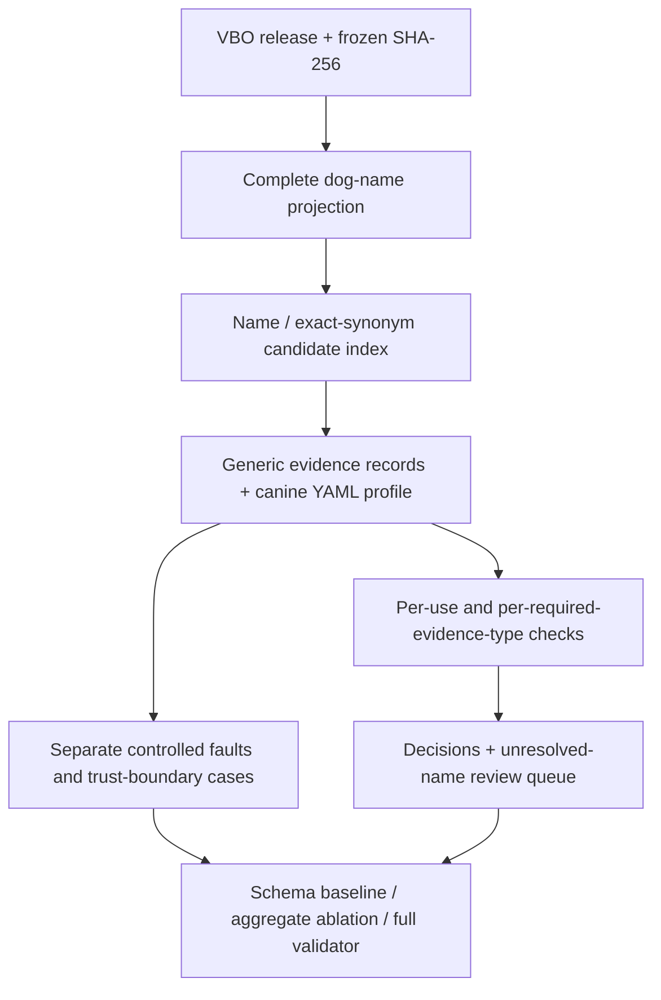

# Real-source case: VBO canine name mapping

This case maps dog names to a **pinned ontology release** using the generic validator.
It uses real public ontology records, not generated breed names. It is an automatic
name-mapping contract demonstration, not genotype verification or a breed classifier.
The legacy canine implementation remains on the
[canine-breed branch](https://github.com/NingyuSUN/bioai-evidence-validator/tree/canine-breed).
No dog-specific rules were added to the generic engine.

## Run offline

From the repository root after `uv sync --frozen --extra dev`:

```bash
uv run python examples/vbo_canine/run.py --output artifacts/vbo-canine
```

Use a new output directory on every run. Outputs include input records, detailed reports,
per-case decisions, a metrics table, and `review_queue.csv` with the 24 ambiguous names
and their candidate IDs. Review decisions, identities and dates are intentionally blank;
no human adjudication has been fabricated. `manifest.json` hashes the completed outputs.
Running twice produces byte-identical artifacts; replay reports omit the run timestamp.



## Source and selection

Source: [Vertebrate Breed Ontology v2026-04-15](https://github.com/monarch-initiative/vertebrate-breed-ontology/releases/tag/v2026-04-15),
commit `8364a3ec538d529bdd3efcf3af8401b98f48fb4f`, by the VBO contributors,
licensed [CC BY 4.0](https://creativecommons.org/licenses/by/4.0/).
See [source provenance](sources/manifest.json) and [attribution](sources/README.md).

The bundled projection includes **all 1,537 non-obsolete VBO terms** reachable beneath
`Dog breed` (`VBO:0400024`) by explicit `is_a` edges, excluding the grouping root.
It retains IDs, labels, EXACT synonyms, parents, and upstream stanza line numbers.
This includes different breed-related concepts and populations; it is not a list of
1,537 universally recognized, genetically distinct breeds. No OWL reasoning or
cross-registry reconciliation is performed.

Casefolding and whitespace normalization yield 5,814 distinct name strings: 1,537
unique canonical names, 3,948 unique synonyms, and 329 ambiguous names. Select 24 from
each stratum by sorting SHA-256(`bioai-vbo-v1:` + normalized name), giving 72 reference
cases. Candidate sets and expected statuses are frozen in [reference_cases.json](reference_cases.json).
For example, `Border Collie` maps to both `VBO:0007996` and `VBO:0200193` in this release;
`Labrador Retriever (Dog)` maps to `VBO:0200800`.

The importer constructs an ontology-name assertion and a candidate-resolution item.
An unambiguous mapping supplies `unique_label_resolution`; an ambiguous mapping does
not. An ambiguous record's object is only a proposed first candidate, never an approved
choice. All candidates remain visible. The YAML profile rejects automatic catalog
admission without uniqueness evidence. This does not declare VBO inconsistent or
any candidate biologically incorrect.

## Evaluation protocol

**Reference labels are source-derived contract expectations, not independent expert
annotations.** They evaluate safe automatic mapping within one source/version. The
index and reference set share that source, so the real-source result primarily verifies
correct ingestion and enforcement. No population-level accuracy claim or confidence
interval is justified. No model is fitted or tuned on these cases.

| Cohort | Construction | What it measures |
|---|---|---|
| Real source: 72 | 24 canonical, 24 unique synonym, 24 ambiguous names | Frozen-source candidate preservation and admission contract |
| Controlled faults: 160 | Every third admitted reference case: 16 seeds × 10 specified mutations | Detection of deliberately injected contract violations |
| Trust boundary: 16 | Nonexistent target ID substituted after trusted ingestion | Whether the generic engine re-verifies source assertions (it does not) |

Controlled faults include required LLM/string/mixed evidence with an auxiliary manual
note, weak uniqueness evidence, neutralized uniqueness evidence, hash/scope mismatch,
dangling references, explicit contradiction, and withdrawn statements. These extraction
methods and faults are **simulated interventions**; no LLM extraction experiment was run.
Mutations of a seed are correlated and must not be counted as independent real-world errors.

Three methods are compared: schema-only; an ablation restoring the old aggregate
extraction-method check while holding other checks fixed; and the full per-required-type
validator. The ablation is not a separate trained model. False admission means accepting
a case whose reference status is rejected or review-required. False block includes either
non-admitted status on an admitted reference. Review rate is reported separately.
Undefined rates with zero denominators are `null`/N/A, not zero.

## Observed results (0.4.1)

| Cohort | Schema-only false admissions | Aggregate-quality false admissions | Full false admissions |
|---|---:|---:|---:|
| Real source | 24/24 | 0/24 | 0/24 |
| Controlled faults | 160/160 | 64/160 | 0/160 |
| Trust boundary | 16/16 | 16/16 | 16/16 |

On the 48 admitted real-source cases, all methods have 0/48 false blocks. Full validation
routes 80/160 controlled cases to review and rejects 80/160. The 24 real ambiguities are
rejected for automatic admission and exported for manual resolution. Results and hashes
are available in [the checked-in summary](results/summary.md).

The 64 corrected false admissions demonstrate this quality-gate regression on constructed
cases. They do not estimate the frequency of that error in production. The 16 unchanged
source-falsification failures show why the validator must sit behind trustworthy ingestion;
changing evidence metadata can still deceive the generic engine.

## Rebuild from original bytes

Download `upstream_url` from the manifest, retaining exact bytes. Then:

```bash
uv run python examples/vbo_canine/prepare_source.py --obo /path/to/vbo.obo --output artifacts/vbo-rebuilt
```

The script verifies the original 21,360,761-byte file SHA-256, then reproduces both the
projection and reference cases byte-for-byte. Runtime needs only the bundled projection;
its actual bytes are hashed before ingestion. Record source hashes identify this projection
using a content-addressed URN; the manifest separately identifies the original OBO file.

## Limitations and next validation step

This case verifies source-grounded name mapping and admission mechanics. It does not verify
source correctness, independent evidence, sample membership, clinical utility, extraction
accuracy, or authenticated human review. Independent curator labels and a second source
are future evaluation work. Reviewers should examine ambiguous concepts in their source
context before defining any approved mapping; no automatic merge of those concepts occurs.
